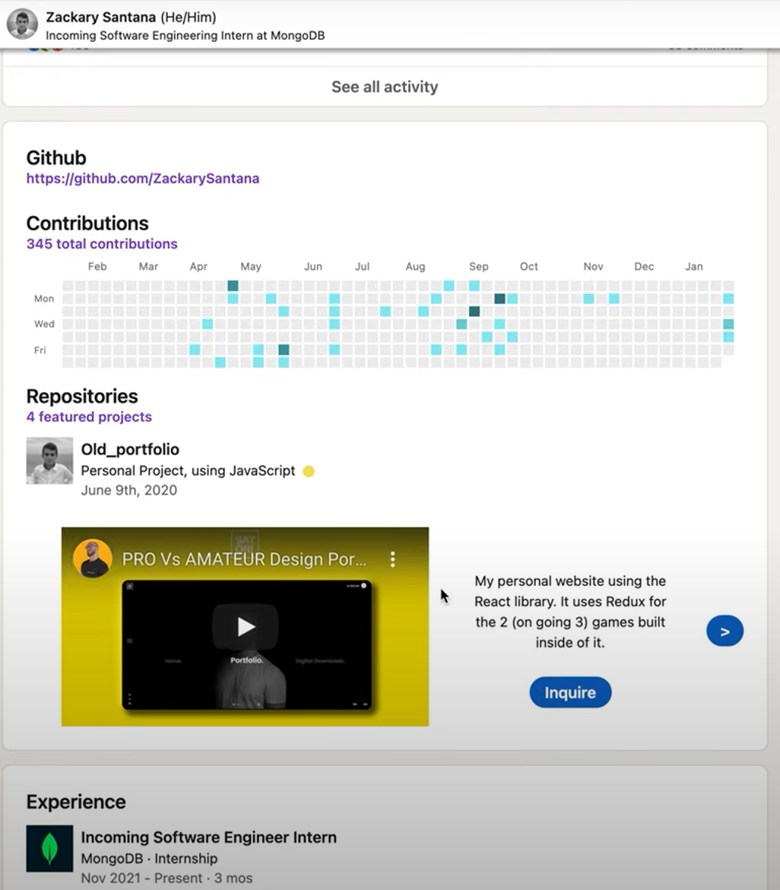

# LinkedHub

## Demo:

https://devpost.com/software/linkedhub

## How to enable (dev)

1. Clone Repo to your machine.
2. Type chrome://extensions/ in omnibox and press enter.
3. In the Extensions page, click on "Load Unpacked", navigate and select the repo folder.

4. Directly Navigating to any user profile will have the "GitHub" section injected before Experience.

Notes:
- Most changes will occur in the injection.js file.
- Navigating to a user profile from a different location, will not inject the content correctly (most likely caused by Angular or something)

